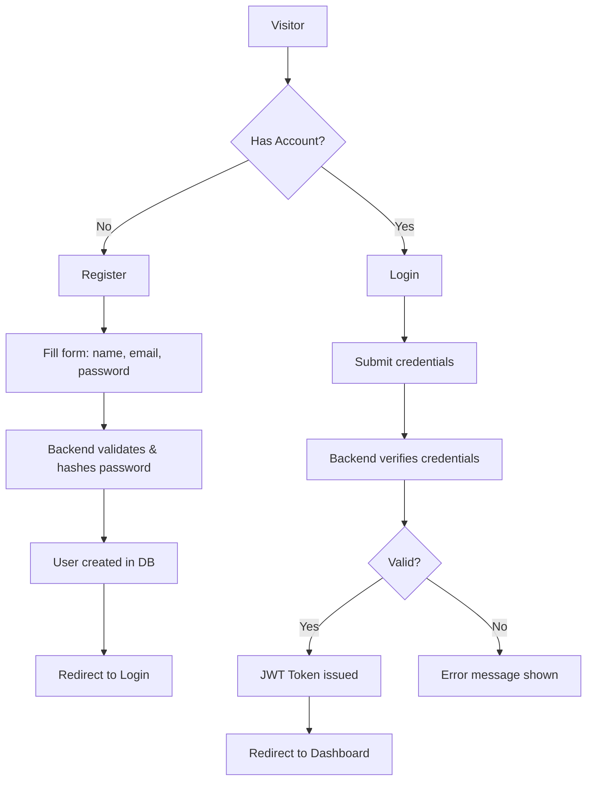
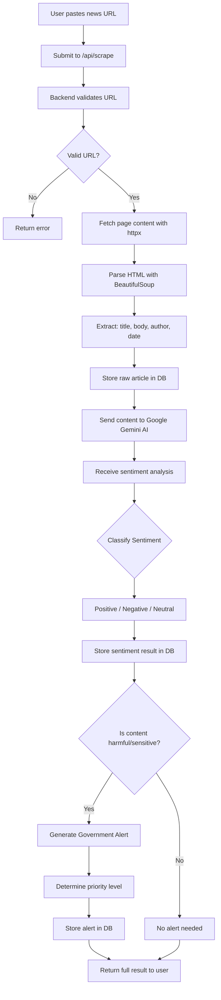
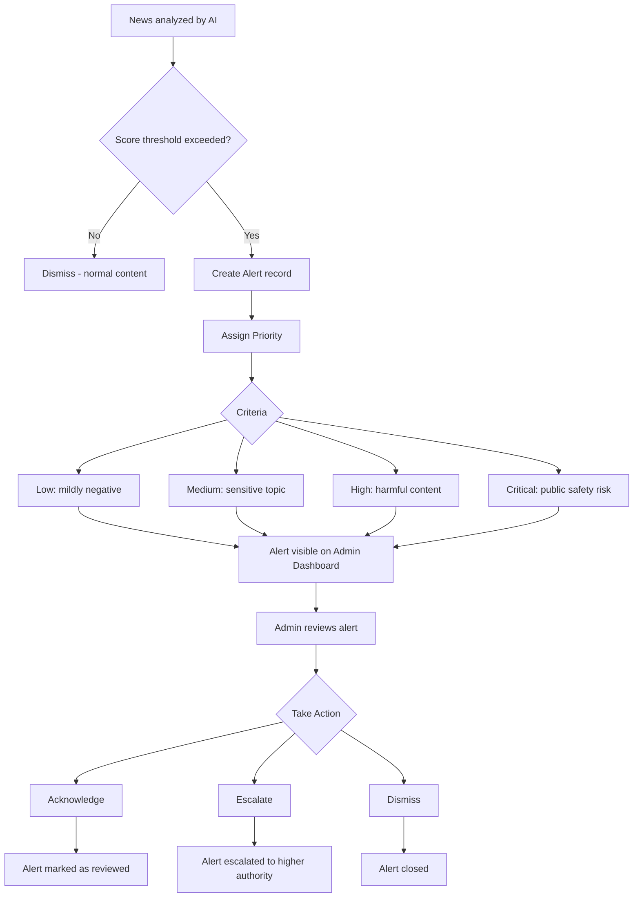
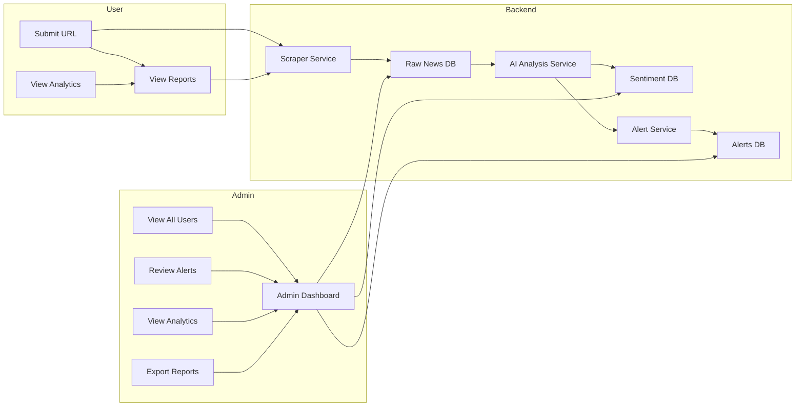

# 360° News Report & Government Feedback System

An intelligent platform that collects news from various sources, analyzes sentiment using AI, identifies potentially harmful or socially impactful content, and provides timely alerts to government authorities through a centralized monitoring dashboard.

---

## System Architecture

```
┌─────────────────────────────────────────────────────────────────────┐
│                         FRONTEND (React + Vite)                     │
│  ┌──────────────┐  ┌──────────────┐  ┌──────────────────────────┐  │
│  │  Auth Pages   │  │ User Dashboard│  │    Admin Dashboard       │  │
│  │ (Login/Register)│ │ - Submit URL │  │ - Manage Users          │  │
│  └──────┬───────┘  │ - My Reports │  │ - View All Reports      │  │
│         │          │ - Analytics  │  │ - Alert Management      │  │
│         │          └──────────────┘  │ - Sentiment Overview    │  │
│         │                            └──────────────────────────┘  │
│         │                    ┌──────────────────┐                   │
│         │                    │  Shared Layouts   │                   │
│         │                    │ (Navbar, Sidebar) │                   │
│         │                    └──────────────────┘                   │
│         └──────────────────────────┬───────────────────────────────┘
│                                    │ HTTP / Axios
└────────────────────────────────────┼────────────────────────────────┘
                                     │
┌────────────────────────────────────┼────────────────────────────────┐
│                         API GATEWAY (FastAPI)                       │
│  ┌──────────┐  ┌──────────┐  ┌──────────┐  ┌──────┐  ┌─────────┐ │
│  │ Auth     │  │ Scraper  │  │Dashboard │  │Alerts│  │ Sources │ │
│  │ Router   │  │ Router   │  │ Router   │  │Router│  │ Router  │ │
│  └────┬─────┘  └────┬─────┘  └────┬─────┘  └──┬───┘  └────┬────┘ │
│       │             │             │           │            │       │
│  ┌────┴─────────────┴─────────────┴───────────┴────────────┴───┐  │
│  │                    Service Layer                              │  │
│  │  ┌──────────┐  ┌──────────┐  ┌──────────┐  ┌─────────────┐  │  │
│  │  │AuthService│  │ScrapeSvc │  │Analysis  │  │AlertService │  │  │
│  │  └──────────┘  └──────────┘  │ Service  │  └─────────────┘  │  │
│  │                              └──────────┘                    │  │
│  └──────────────────────────────────────────────────────────────┘  │
│         │             │             │           │                  │
│  ┌──────┴─────────────┴─────────────┴───────────┴──────────────┐  │
│  │                    Models / ORM (SQLAlchemy)                 │  │
│  │  User ────── News ────── Sentiment ────── Alert ──── Source │  │
│  └────────────────────────────┬────────────────────────────────┘  │
│                               │                                    │
│                        ┌──────┴──────┐                            │
│                        │   SQLite    │                            │
│                        │ (PostgreSQL │                            │
│                        │   ready)    │                            │
│                        └─────────────┘                            │
└────────────────────────────────────────────────────────────────────┘
                               │
          ┌────────────────────┼────────────────────┐
          ▼                    ▼                    ▼
   ┌────────────┐     ┌──────────────┐     ┌──────────────┐
   │ Google     │     │  External    │     │  External    │
   │ Gemini AI  │     │  News Sites  │     │  APIs        │
   │ (Sentiment │     │  (Scraping)  │     │              │
   │  Analysis) │     │              │     │              │
   └────────────┘     └──────────────┘     └──────────────┘
```

---

## Flow Diagrams

### 1. User Registration & Login Flow



### 2. News Scraping & Analysis Flow



### 3. Alert Generation & Review Flow



### 4. Data Flow Diagram



---

## Features

### News Scraping & Analysis
- Paste any news article URL for automatic content extraction
- AI-powered sentiment analysis (Positive / Negative / Neutral)
- News categorization and trend analysis
- Fake news detection

### Government Alert System
- Auto-generated alerts for harmful or sensitive content
- Priority levels (Low, Medium, High, Critical)
- Centralized admin review dashboard
- Escalation workflow for critical alerts

### Dual Dashboard

| Feature | Admin | User |
|---------|-------|------|
| View users | ✅ | ❌ |
| Manage users | ✅ | ❌ |
| Submit news URL | ✅ | ✅ |
| View scraping history | ✅ | ✅ |
| Sentiment analysis reports | ✅ | ✅ |
| Review government alerts | ✅ | ❌ |
| Analytics & statistics | ✅ | ✅ |
| News category management | ✅ | ❌ |
| Export reports | ✅ | ❌ |
| Receive notifications | ✅ | ✅ |
| Profile management | ✅ | ✅ |

### Additional Capabilities
- Interactive charts and data visualization (Recharts)
- Report generation (PDF/Excel)
- Audit logs and security monitoring
- Real-time notifications
- Search and filtering system
- News trend analysis
- Government feedback tracking

---

## Tech Stack

| Layer          | Technology                                      |
|----------------|-------------------------------------------------|
| **Frontend**   | React 18, Vite, Tailwind CSS, Recharts          |
| **Backend**    | FastAPI, SQLAlchemy 2.0, Pydantic v2            |
| **AI / NLP**   | Google Gemini API, TextBlob                     |
| **Database**   | SQLite (dev), PostgreSQL-ready (prod)           |
| **Scraping**   | BeautifulSoup 4, httpx, lxml                    |
| **Auth**       | JWT (python-jose) + bcrypt (passlib)            |
| **Runtime**    | Python 3.10+, Node.js 18+, Uvicorn              |

---

## Database Schema (Entity Relationship)

```
┌─────────────────┐       ┌──────────────────┐
│      User       │       │      News         │
├─────────────────┤       ├──────────────────┤
│ id (PK)         │──┐    │ id (PK)          │
│ username        │  └───>│ user_id (FK)     │
│ email           │       │ url              │
│ hashed_password │       │ title            │
│ role (admin/user)│      │ content          │
│ is_active       │       │ source           │
│ created_at      │       │ author           │
└─────────────────┘       │ published_date   │
                          │ scraped_at       │
                          └────────┬─────────┘
                                   │
                          ┌────────▼─────────┐
                          │   Sentiment       │
                          ├──────────────────┤
                          │ id (PK)          │
                          │ news_id (FK)     │
                          │ sentiment (pos/  │
                          │  neg/neu)        │
                          │ score            │
                          │ summary          │
                          │ analyzed_at      │
                          └────────┬─────────┘
                                   │
                          ┌────────▼─────────┐
                          │     Alert         │
                          ├──────────────────┤
                          │ id (PK)          │
                          │ news_id (FK)     │
                          │ priority (low/   │
                          │  med/high/crit)  │
                          │ status (new/     │
                          │  reviewing/done) │
                          │ triggered_by     │
                          │ created_at       │
                          │ resolved_by (FK) │
                          │ resolved_at      │
                          └──────────────────┘
```

---

## Project Structure

```
360-news-report/
│
├── backend/                          # FastAPI Backend
│   ├── app/
│   │   ├── main.py                   # App entry point, CORS, router registration
│   │   ├── config.py                 # Environment variables & settings
│   │   ├── database.py               # SQLAlchemy engine & session setup
│   │   │
│   │   ├── models/                   # Database models
│   │   │   ├── __init__.py
│   │   │   ├── user.py               # User model
│   │   │   ├── news.py               # News article model
│   │   │   ├── sentiment.py          # Sentiment analysis model
│   │   │   ├── alert.py              # Alert model
│   │   │   └── source.py             # News source model
│   │   │
│   │   ├── schemas/                  # Pydantic schemas (request/response)
│   │   │   ├── __init__.py
│   │   │   ├── auth.py               # Auth request/response schemas
│   │   │   ├── news.py               # News schemas
│   │   │   ├── sentiment.py          # Sentiment schemas
│   │   │   ├── alert.py              # Alert schemas
│   │   │   └── source.py             # Source schemas
│   │   │
│   │   ├── routers/                  # API route handlers
│   │   │   ├── __init__.py
│   │   │   ├── auth.py               # /api/auth/*
│   │   │   ├── scraper.py            # /api/scrape
│   │   │   ├── dashboard.py          # /api/dashboard/*
│   │   │   ├── alerts.py             # /api/alerts/*
│   │   │   └── sources.py            # /api/sources/*
│   │   │
│   │   └── services/                 # Business logic layer
│   │       ├── __init__.py
│   │       ├── auth_service.py       # Authentication & JWT logic
│   │       ├── scraper_service.py    # Web scraping logic
│   │       ├── analysis_service.py   # AI sentiment analysis
│   │       └── alert_service.py      # Alert generation & management
│   │
│   ├── seed.py                       # Database seeder
│   ├── requirements.txt
│   └── .env.example                  # Environment template
│
├── frontend/                         # React Frontend
│   ├── public/
│   │   └── favicon.ico
│   ├── src/
│   │   ├── main.jsx                  # Entry point
│   │   ├── App.jsx                   # Root component with routes
│   │   │
│   │   ├── components/               # Reusable components
│   │   │   ├── Layout/
│   │   │   │   ├── Navbar.jsx
│   │   │   │   ├── Sidebar.jsx
│   │   │   │   └── Footer.jsx
│   │   │   └── common/
│   │   │       ├── Loader.jsx
│   │   │       ├── Alert.jsx
│   │   │       └── Chart.jsx
│   │   │
│   │   ├── pages/                    # Page components
│   │   │   ├── auth/
│   │   │   │   ├── Login.jsx
│   │   │   │   └── Register.jsx
│   │   │   ├── user/
│   │   │   │   ├── Dashboard.jsx
│   │   │   │   ├── SubmitUrl.jsx
│   │   │   │   ├── MyReports.jsx
│   │   │   │   └── Profile.jsx
│   │   │   └── admin/
│   │   │       ├── Dashboard.jsx
│   │   │       ├── Users.jsx
│   │   │       ├── Reports.jsx
│   │   │       ├── Alerts.jsx
│   │   │       └── Analytics.jsx
│   │   │
│   │   ├── services/                 # API client layer
│   │   │   └── api.js                # Axios instance & interceptors
│   │   │
│   │   ├── hooks/                    # Custom hooks
│   │   │   ├── useAuth.js
│   │   │   └── useDashboard.js
│   │   │
│   │   ├── context/                  # React context
│   │   │   └── AuthContext.jsx
│   │   │
│   │   └── utils/                    # Utility functions
│   │       ├── constants.js
│   │       └── helpers.js
│   │
│   ├── index.html
│   ├── package.json
│   └── vite.config.js
│
├── exports/                          # Generated reports (PDF/Excel)
├── venv/                             # Python virtual environment (gitignored)
├── .gitignore
├── README.md
├── LICENSE
└── run.ps1                           # Windows launcher script
```

---

## User Roles & Permissions

| Permission               | Admin | Regular User |
|--------------------------|:-----:|:------------:|
| Login / Register         | ✅    | ✅           |
| Submit news URL          | ✅    | ✅           |
| View own reports         | ✅    | ✅           |
| View all users           | ✅    | ❌           |
| View all reports         | ✅    | ❌           |
| View alerts              | ✅    | ❌           |
| Manage alerts            | ✅    | ❌           |
| Manage users             | ✅    | ❌           |
| Export reports           | ✅    | ❌           |
| View analytics           | ✅    | ✅           |

---

## API Endpoints

### Authentication

| Method | Endpoint               | Auth Required | Description              |
|--------|------------------------|:------------:|--------------------------|
| POST   | `/api/auth/register`   | ❌           | Register a new user      |
| POST   | `/api/auth/login`      | ❌           | Login & receive JWT      |
| GET    | `/api/auth/me`         | ✅           | Get current user profile |

### News & Scraping

| Method | Endpoint               | Auth Required | Description              |
|--------|------------------------|:------------:|--------------------------|
| POST   | `/api/scrape`          | ✅           | Scrape a news article URL|
| GET    | `/api/scrape/history`  | ✅           | Get user's scrape history|
| GET    | `/api/scrape/{id}`     | ✅           | Get specific scrape detail|

### Dashboard

| Method | Endpoint                     | Auth Required | Role  | Description                |
|--------|------------------------------|:------------:|:-----:|----------------------------|
| GET    | `/api/dashboard/stats`       | ✅           | Any   | Get dashboard statistics   |
| GET    | `/api/dashboard/admin`       | ✅           | Admin | Admin-specific dashboard   |
| GET    | `/api/dashboard/trends`      | ✅           | Any   | Sentiment trend data       |

### Alerts

| Method | Endpoint                     | Auth Required | Role  | Description                |
|--------|------------------------------|:------------:|:-----:|----------------------------|
| GET    | `/api/alerts`                | ✅           | Admin | List all alerts            |
| PATCH  | `/api/alerts/{id}`           | ✅           | Admin | Update alert status        |
| DELETE | `/api/alerts/{id}`           | ✅           | Admin | Delete an alert            |

### Sources

| Method | Endpoint                     | Auth Required | Role  | Description                |
|--------|------------------------------|:------------:|:-----:|----------------------------|
| GET    | `/api/sources`               | ✅           | Any   | List news sources          |
| POST   | `/api/sources`               | ✅           | Admin | Add a news source          |
| DELETE | `/api/sources/{id}`          | ✅           | Admin | Delete a source            |

### System

| Method | Endpoint               | Auth Required | Description              |
|--------|------------------------|:------------:|--------------------------|
| GET    | `/api/health`          | ❌           | Health check             |

---

## Prerequisites

- Python 3.10+
- Node.js 18+
- Google Gemini API key — [get one here](https://aistudio.google.com/apikey)

---

## Setup

### 1. Clone and enter the project

```bash
git clone <repo-url> 360-news-report
cd 360-news-report
```

### 2. Backend setup

```bash
python -m venv venv

# Windows
.\venv\Scripts\Activate.ps1
# Linux/Mac
# source venv/bin/activate

pip install -r backend/requirements.txt
```

### 3. Configure environment

```bash
cp backend/.env.example backend/.env
```

Edit `backend/.env` and set your `GEMINI_API_KEY`.

### 4. Frontend setup

```bash
cd frontend
npm install
cd ..
```

### 5. Seed the database (optional)

```bash
cd backend
python seed.py
cd ..
```

Default admin credentials: `admin` / `admin123`

---

## Running the Application

### Option 1 — One command (Windows)

```powershell
.\run.ps1
```

### Option 2 — Individual terminals

**Terminal 1 — Backend**
```bash
.\venv\Scripts\Activate.ps1
cd backend
uvicorn app.main:app --host 127.0.0.1 --port 8765 --reload
```

**Terminal 2 — Frontend**
```bash
cd frontend
npm run dev
```

### URLs

| Service       | URL                          |
|---------------|------------------------------|
| Application   | http://localhost:5173        |
| API Docs      | http://127.0.0.1:8765/docs   |
| API (Swagger) | http://127.0.0.1:8765/redoc  |

---

## Troubleshooting

### `uvicorn` command not found
```bash
python -m pip uninstall uvicorn -y
python -m pip install uvicorn
# or use:
python -m uvicorn app.main:app --host 127.0.0.1 --port 8765 --reload
```

### Port already in use
```bash
# Find process using port
netstat -ano | findstr :8765
# Kill it (replace PID)
taskkill /PID <PID> /F
```

---

## License

Distributed under the MIT License. See `LICENSE` for more information.
